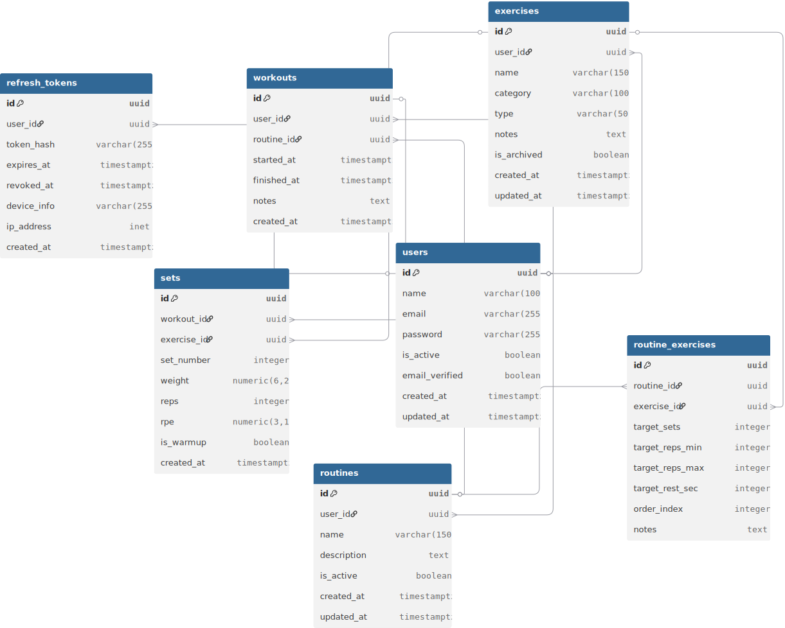

<div align="center">

<!-- Place your logo at docs/logo.png -->


# Overload API

[](https://nestjs.com/)
[](https://www.typescriptlang.org/)
[](https://www.postgresql.org/)
[](https://www.prisma.io/)
[](https://nodejs.org/)
[](https://www.docker.com/)
[](https://pnpm.io/)
[](https://biomejs.dev/)
[](./LICENSE)

**REST API for advanced strength training tracking.**  
Manage workouts, sets, weights, personal records and training volume.

</div>

---

## Table of Contents

- [Overload API](#overload-api)
  - [Table of Contents](#table-of-contents)
  - [Description](#description)
  - [Tech Stack](#tech-stack)
  - [Features \& Roadmap](#features--roadmap)
  - [Project Architecture](#project-architecture)
  - [Database Schema](#database-schema)
  - [Environment Variables](#environment-variables)
  - [Installation \& Setup](#installation--setup)
    - [Prerequisites](#prerequisites)
    - [Steps](#steps)
  - [Available Commands](#available-commands)
    - [Development](#development)
    - [Database](#database)
    - [Code Quality](#code-quality)
  - [API Documentation](#api-documentation)
  - [License](#license)

---

## Description

**Overload API** is the backend of a strength training application built around the principle of *progressive overload*: gradually increasing the training stimulus to drive continuous and measurable muscular adaptations.

Most gym apps are simple logs. This API goes further: it automatically calculates total training volume, detects new PRs the moment they happen, and estimates 1RM so athletes can plan their loads with data, not guesswork.

Built with **NestJS 11**, it exposes a REST API with JWT + Refresh Token authentication, a modular architecture, and full Docker support for development.

---

## Tech Stack

**Core**


**Database & ORM**


**Auth & Validation**


**Infrastructure & Tooling**


---

## Features & Roadmap

| Module                                                                                      | Status        |
| ------------------------------------------------------------------------------------------- | ------------- |
| **Authentication** — Register, login, logout and JWT refresh tokens                         | ✅ Done        |
| **Exercise Management** — Full CRUD for the user's personal exercise catalog                | 🚧 In progress |
| **Routines** — Training plans with target sets, reps and rest times                         | 📋 Planned     |
| **Workout Execution** — Real-time tracking of active training sessions                      | 📋 Planned     |
| **Set Logging** — Weight and rep tracking with last-used weight history                     | 📋 Planned     |
| **Training History** — Past sessions with advanced filters                                  | 📋 Planned     |
| **Automatic PR Detection** — Algorithm that identifies new records instantly                | 📋 Planned     |
| **Volume Calculation** — Total volume stats (weight × reps × sets) per session and exercise | 📋 Planned     |
| **1RM Estimation** — One rep max calculation using the Epley formula                        | 📋 Planned     |

## Project Architecture

The project follows NestJS's modular architecture. Each business domain is encapsulated in its own module with an independent controller, service and DTOs. The Prisma client is generated into `generated/prisma` instead of `node_modules`, keeping it visible and under version control.

```
overload-api/
├── docs/                    # Project documentation (DB schema, features, logo)
├── generated/prisma/        # Auto-generated Prisma client — do not edit directly
├── prisma/
│   ├── migrations/          # Migration history
│   ├── schema.prisma        # Data model definition
│   └── seed.ts              # Initial data seed script
├── src/
│   ├── auth/                # F-01: Authentication (register, login, logout, refresh)
│   ├── jwt/                 # Internal JWT module: signing, verification and guard
│   ├── user/                # User management
│   ├── exercises/           # F-02: Personal exercise catalog CRUD
│   ├── routines/            # F-03: Training plan management
│   ├── workouts/            # F-04 & F-06: Workout execution and history
│   ├── sets/                # F-05: Individual set logging
│   ├── analytics/           # F-07, F-08 & F-09: PRs, volume and 1RM
│   ├── prisma/              # Global Prisma module, injectable across the app
│   ├── config/              # Environment variable validation with Zod
│   ├── types/               # Type extensions (Express, globals)
│   ├── app.module.ts        # Root module
│   └── main.ts              # Bootstrap: Swagger, Helmet, CORS, global pipes
├── docker-compose.yml       # Development environment with hot-reload
└── Dockerfile               # Development build stage
```

---

## Database Schema

The schema consists of seven tables. Derived metrics (volume, 1RM, PRs) are calculated on demand and never persisted.



Key design decisions:

- **Access tokens are stateless** and never stored. Only refresh tokens are persisted, as a SHA-256 hash — never in plain text.
- **Exercises are never hard-deleted** if they have associated history. They are soft-deleted via `is_archived = TRUE`.
- **Warmup sets** (`is_warmup = TRUE`) are recorded but excluded from PR detection and volume calculations.
- A **workout** can exist without an associated routine to support spontaneous training sessions.

> The full schema with all columns, indexes and constraints is in [`docs/database-schema.md`](./docs/database-schema.md).

---

## Environment Variables

Copy the example file before starting:

```bash
cp .env.example .env
```

| Variable                | Description                          | Default / Example       |
| ----------------------- | ------------------------------------ | ----------------------- |
| `POSTGRES_USER`         | PostgreSQL username                  | `overload_user`         |
| `POSTGRES_PASSWORD`     | PostgreSQL password                  | —                       |
| `POSTGRES_DB`           | Database name                        | `overload_db`           |
| `POSTGRES_PORT`         | PostgreSQL port exposed on the host  | `5432`                  |
| `PORT`                  | Port the API listens on              | `3000`                  |
| `NODE_ENV`              | Runtime environment                  | `development`           |
| `JWT_SECRET`            | Secret key for signing access tokens | —                       |
| `JWT_ACCESS_TOKEN_TTL`  | Access token duration                | `15m`                   |
| `JWT_REFRESH_TOKEN_TTL` | Refresh token duration               | `7d`                    |
| `CORS_ORIGIN`           | Allowed CORS origin                  | `http://localhost:5173` |
| `BCRYPT_ROUNDS`         | bcrypt hashing rounds                | `10`                    |

> `DATABASE_URL` is built automatically by Docker Compose from the PostgreSQL variables above. Only define it manually if running the app outside of Docker.

> **Never** commit your `.env` file to the repository. It is included in `.gitignore` by default.

---

## Installation & Setup

### Prerequisites

- [Docker](https://www.docker.com/) and Docker Compose installed
- [pnpm](https://pnpm.io/) — `npm install -g pnpm`
- Node.js v22+ (only if running outside Docker)

### Steps

**1. Clone the repository**

```bash
git clone https://github.com/JosepRivera/overload-api.git
cd overload-api
```

**2. Set up environment variables**

```bash
cp .env.example .env
# Fill in your PostgreSQL credentials and JWT secrets
```

**3. Install dependencies locally (optional, for IDE support)**

```bash
pnpm install
```

**4. Start the development environment with Docker**

```bash
pnpm run dev
```

This starts two containers: `overload-postgres-dev` and `overload-app-dev`. The app runs in watch mode — any change in `src/` is reflected automatically. Pending migrations are applied on startup.

The API will be available at `http://localhost:3000`.

> Port `9229` is also exposed for connecting an external debugger (VS Code, Chrome DevTools).

---

## Common Workflows

To maintain a consistent environment, the application runs inside Docker, but you manage your code and dependencies locally.

### 1. Adding or Updating Dependencies
When you need to add a new package (e.g., `zod` or `dayjs`):

1. **Install locally:** Run `pnpm add <package-name>` in your terminal. This updates your `package.json` and `pnpm-lock.yaml`.
2. **Sync with Docker:** Rebuild the container to include the new dependency:
   ```bash
   pnpm run dev:build
   ```

### 2. Database Migrations (Prisma)
If you modify `prisma/schema.prisma`:

1. **Create and apply migration:** Run the following command. It will ask for a name and apply it to the database inside Docker:
   ```bash
   pnpm run db:migrate
   ```
2. **Note on Startup:** When the container starts (`pnpm run dev`), it automatically runs `prisma migrate deploy` to ensure your local DB is up to date with existing migrations.

---

## Available Commands

All commands are designed to be run from your **local machine**. They will automatically interact with the Docker containers when necessary.

### Development

| Command              | Location | Description                                           |
| -------------------- | -------- | ----------------------------------------------------- |
| `pnpm run dev`       | Local    | Start the environment with Docker Compose             |
| `pnpm run dev:build` | Local    | **Rebuild** images and start (use after adding deps)  |
| `pnpm run stop`      | Local    | Stop and remove development containers                |
| `pnpm run shell`     | Docker   | Open an interactive shell inside the `overload-app`   |
| `pnpm run clean`     | Local    | Stop containers and **remove volumes** (wipes DB)     |

### Database (Prisma)

| Command               | Location | Description                                     |
| --------------------- | -------- | ----------------------------------------------- |
| `pnpm run db:migrate` | Docker   | Create and apply a new migration                |
| `pnpm run db:studio`  | Docker   | Open Prisma Studio (GUI for browsing the DB)    |
| `pnpm run db:seed`    | Docker   | Run the seed script with sample data            |

### Code Quality & Maintenance

| Command           | Location | Description                          |
| ----------------- | -------- | ------------------------------------ |
| `pnpm run lint`   | Local    | Lint and auto-fix code with Biome    |
| `pnpm run format` | Local    | Format code automatically with Biome |
| `pnpm run build`  | Local    | Compile TypeScript to `dist/`        |
| `pnpm run test`   | Local    | Run unit tests                       |

---

## API Documentation

Once the server is running, the interactive Swagger documentation will be available at:

```
http://localhost:3000/api/docs
```

All endpoints, request/response schemas and examples are documented there. Protected endpoints require a Bearer Token — get one from `POST /auth/login` and paste it into the **Authorize** button in Swagger UI.

---

## License

This project is licensed under the **MIT License**. See the [LICENSE](./LICENSE) file for details.
