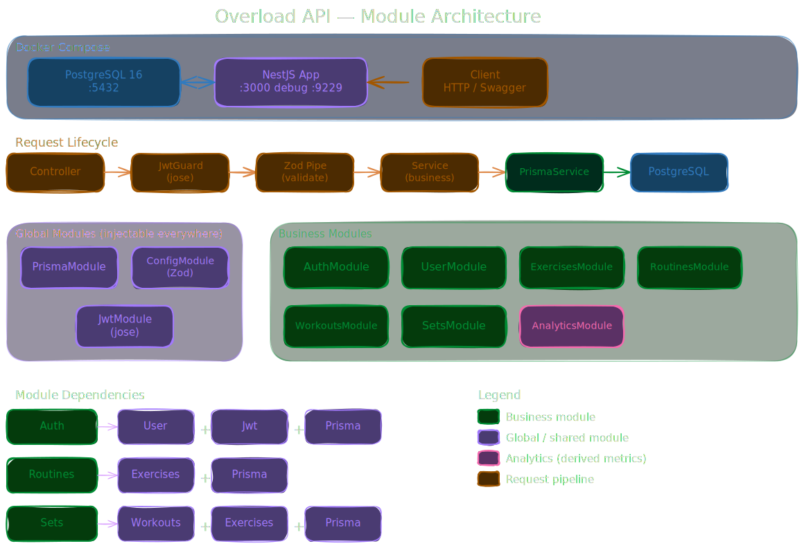

# Architecture — Overload API

## Overview

Overload API is a REST API for advanced strength training tracking built around the principle of **progressive overload**: gradually increasing the training stimulus to drive continuous and measurable muscular adaptations.

Built with **NestJS 11** following a strict modular architecture, **PostgreSQL** as the primary database, and **Prisma** as the ORM.

---

## Visual Diagrams

### Module Architecture


### Database Schema


> Export both diagrams from Excalidraw and save them in `docs/assets/`.

---

## Module Structure

```
src/
├── auth/           # Registration, login, logout, token refresh
├── jwt/            # JWT signing, verification and guard (jose)
├── user/           # User profile management
├── exercises/      # Personal exercise catalog CRUD
├── routines/       # Training plan management
├── workouts/       # Workout session execution and history
├── sets/           # Individual set logging
├── analytics/      # PRs, volume calculation and 1RM estimation
├── prisma/         # Global Prisma module, injectable across the app
├── config/         # Environment variable validation with Zod
├── types/          # Type extensions (Express, globals)
├── app.module.ts   # Root module
└── main.ts         # Bootstrap: Swagger, Helmet, CORS, global pipes
```

---

## Request Lifecycle

```
Client Request
     │
     ▼
main.ts (Helmet, CORS, Global Pipes)
     │
     ▼
Controller (route matching)
     │
     ▼
JwtGuard (validates access token via jose)
     │
     ▼
Zod Pipe (validates and parses request body)
     │
     ▼
Service (business logic)
     │
     ▼
PrismaService (database access)
     │
     ▼
PostgreSQL
     │
     ▼
Response → Client
```

---

## Authentication Flow

```
POST /auth/register → hash password (bcrypt, cost 12) → create user
POST /auth/login    → verify password → issue access token (15m) + refresh token (7d)
POST /auth/refresh  → validate refresh token hash → rotate tokens
POST /auth/logout   → revoke refresh token (revoked_at = NOW())
```

**Key decisions:**
- Access tokens are stateless JWT — never stored in DB
- Refresh tokens stored as SHA-256 hash — never in plain text
- Max 5 active refresh tokens per user
- Token rotation: previous token is revoked on each refresh

---

## Module Dependencies

| Module          | Depends on                                      |
| --------------- | ----------------------------------------------- |
| AuthModule      | UserModule + JwtModule + PrismaModule           |
| JwtModule       | standalone (jose)                               |
| UserModule      | PrismaModule                                    |
| ExercisesModule | PrismaModule                                    |
| RoutinesModule  | ExercisesModule + PrismaModule                  |
| WorkoutsModule  | RoutinesModule + PrismaModule                   |
| SetsModule      | WorkoutsModule + ExercisesModule + PrismaModule |
| AnalyticsModule | PrismaModule                                    |
| PrismaModule    | global — no dependencies                        |
| ConfigModule    | global — Zod validation                         |

---

## Infrastructure

```
Docker Compose (development)
├── overload-postgres-dev   # PostgreSQL 16 — port 5432
└── overload-app-dev        # NestJS app with hot-reload — port 3000
                            # Debugger exposed on port 9229
```

Pending migrations are applied automatically on container startup via `prisma migrate deploy`.

---

## Database

The schema consists of 7 tables. Derived metrics (volume, PRs, 1RM) are calculated on-demand and never persisted.

See full schema reference: [database-schema.md](./database-schema.md)

---

## Key Design Decisions

| Decision             | Choice                                | ADR                                                           |
| -------------------- | ------------------------------------- | ------------------------------------------------------------- |
| Validation           | Zod over class-validator              | [0001](./decisions/0001-zod-over-class-validator.md)          |
| Linting & Formatting | Biome over ESLint + Prettier          | [0002](./decisions/0002-biome-over-eslint-prettier.md)        |
| ORM                  | Prisma over TypeORM                   | [0003](./decisions/0003-prisma-over-typeorm.md)               |
| Database             | PostgreSQL over MongoDB               | [0004](./decisions/0004-postgresql-over-mongodb.md)           |
| Authentication       | JWT stateless + refresh tokens in DB  | [0005](./decisions/0005-jwt-stateless-with-refresh-tokens.md) |
| Metrics              | Calculated on-demand, never persisted | [0006](./decisions/0006-metrics-calculated-on-demand.md)      |
| Exercise deletion    | Soft delete via is_archived           | [0007](./decisions/0007-soft-delete-on-exercises.md)          |
| Warmup sets          | Excluded from stats and PRs           | [0008](./decisions/0008-warmup-sets-excluded-from-stats.md)   |
| Active workouts      | Max 1 per user at a time              | [0009](./decisions/0009-one-active-workout-per-user.md)       |
| Refresh tokens       | Max 5 active per user                 | [0010](./decisions/0010-max-five-refresh-tokens-per-user.md)  |
| JWT library          | jose over @nestjs/jwt                 | [0011](./decisions/0011-jose-over-nestjs-jwt.md)              |